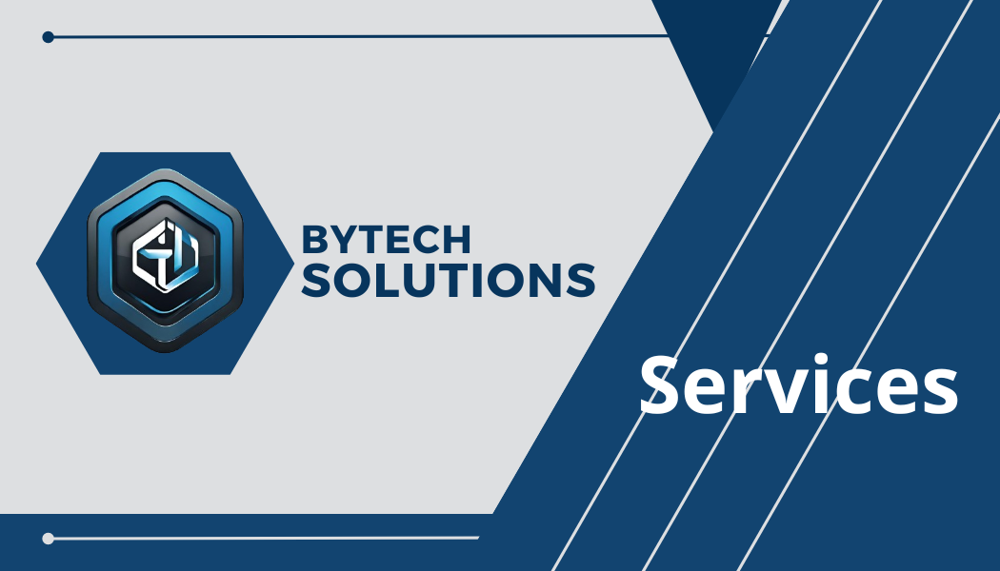

# Bienvenido a BYTECH SOLUTIONS

 

En BYTECH SOLUTIONS, estamos comprometidos a proporcionar soluciones informáticas y servicios en la nube de alta calidad para satisfacer las necesidades de nuestros clientes. Desde el diseño web hasta la consultoría blockchain, ofrecemos una amplia gama de servicios para ayudarte a impulsar tu negocio en el mundo digital.

## Servicios

- [Diseño Web](./issues/1): Creamos sitios web atractivos y funcionales que se adaptan a las necesidades únicas de tu negocio.
- [Consultoría Blockchain](./issues/2): Asesoramos sobre la implementación y aplicación de tecnología blockchain para mejorar la eficiencia y seguridad de tu empresa.
- [Traducción de Documentos con IA](./issues/3): Utilizamos tecnologías de inteligencia artificial para ofrecer servicios de traducción de documentos precisos y eficientes.
- [Configuración de Correos Empresariales](./issues/4): Configuramos correos electrónicos empresariales para mejorar la comunicación interna y externa de tu empresa.
- [Creación de Tarjetas Empresariales](./issues/5): Diseñamos y imprimimos tarjetas de presentación profesionales que destacan la identidad de tu negocio.

## Cómo Contribuir

Si estás interesado en alguno de nuestros servicios o tienes alguna pregunta, no dudes en abrir un nuevo issue en el repositorio. Estamos aquí para ayudarte.

¡Gracias por elegir BYTECH SOLUTIONS para tus necesidades informáticas y en la nube!

--- 

Este README.md proporciona una visión general de los servicios ofrecidos por BYTECH SOLUTIONS, así como un enlace a cada servicio específico en forma de issue en el repositorio. Es atractivo, sencillo y descriptivo, lo que permite a los usuarios comprender rápidamente lo que ofrecemos y cómo pueden interactuar con nosotros.